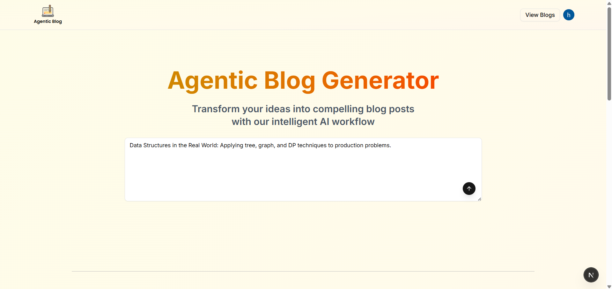
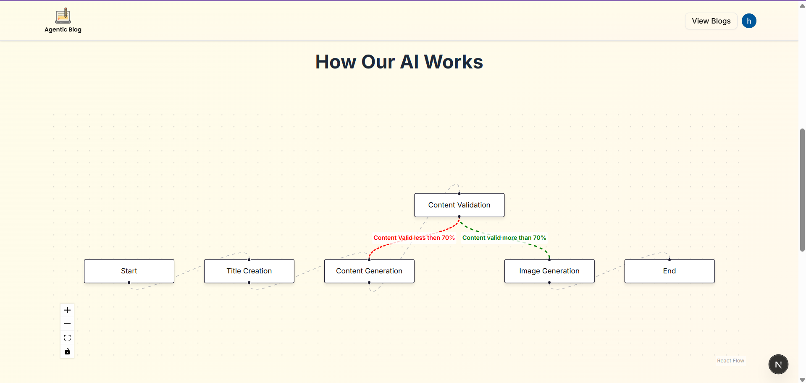
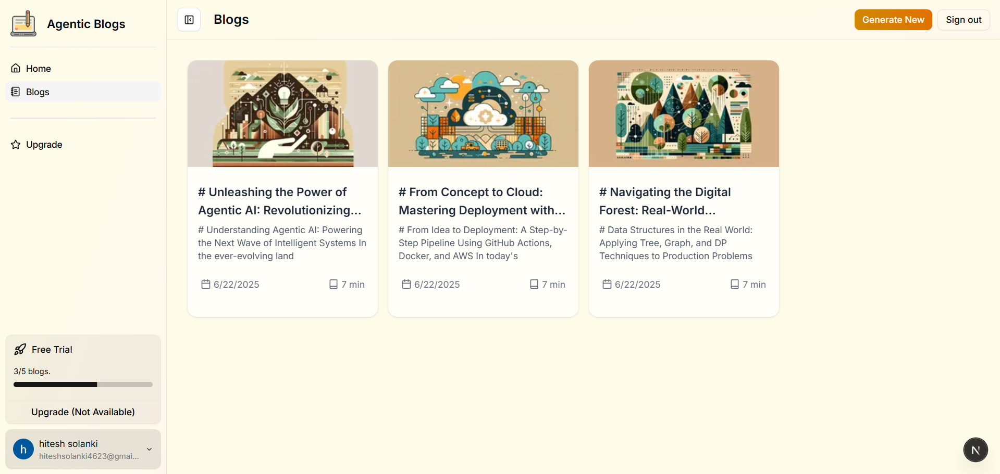

# Agentic Blog Generator (Full-Stack)

---

## 🔗 Live Demo

👉 [https://blog-generator-tau.vercel.app/](https://blog-generator-tau.vercel.app/)

## 🔗 ScreenShot







## 📂 Repository Structure

```
/ (root)
├── blog-generator-be/      # Python FastAPI back‑end (AI & API logic)
├── blog-generator-fe/      # Next.js front‑end (UI & Client)
├── images/                 # AI‑generated header images (optional storage)
└── README.md               # This documentation
```

---

## 🚀 Overview

**Blog Generator** is a monorepo containing two standalone apps:

1. **Back‑end (blog-generator-be)**: A FastAPI service that implements a multi-stage AI workflow:

   - Title creation
   - Content generation
   - Content validation (pass/fail routing)
   - Image generation
   - REST API endpoints for front‑end consumption

2. **Front‑end (blog-generator-fe)**: A Next.js application that:

   - Authenticates users via Clerk
   - Presents a prompt form and React Flow graph
   - Renders and manages blogs (list, detail, share)

Both apps are production‑ready, containerizable, and deployed on Vercel (Front‑end) and can run anywhere Python apps are supported (Back‑end).

---

## 🛠 Back‑end (blog-generator-be)

### 📋 Contents

```
blog-generator-be/
├── app.py            # FastAPI app entrypoint
├── src/              # AI workflow modules & routers
├── command.md        # CLI & deployment commands
├── Dockerfile        # Container image spec
├── requirements.txt  # Python dependencies
└── .env.example      # Sample env vars (copy to .env)
```

### ⚙️ Setup & Run Locally

1. **Enter the folder**

   ```bash
   cd blog-generator-be
   ```

2. **Copy & configure env**

   ```bash
   cp .env.example .env
   # Then open .env and set:
   # OPENAI_API_KEY=
   # LANGGRAPH_API_KEY=
   # DATABASE_URL=postgresql://...
   ```

3. **Install dependencies**

   ```bash
   pip install -r requirements.txt
   ```

4. **Run the server**

   ```bash
   uvicorn app:app --reload --host 0.0.0.0 --port 8000
   ```

5. **Test endpoints**

   - Open [http://localhost:8000/docs](http://localhost:8000/docs) for interactive OpenAPI UI.

### 🐳 Docker

> Build and run via Docker

```bash
cd blog-generator-be
# Build image
docker build -t blog-be:latest .
# Run container
docker run -d --name blog-be -p 8000:8000 --env-file ./.env blog-be:latest
```

---

## 💻 Front‑end (blog-generator-fe)

### 📋 Contents

```
blog-generator-fe/
├── pages/                 # Next.js App Router pages
├── components/            # UI & graph components
├── styles/                # Tailwind + shadcn/ui configs
├── public/                # Static assets & images
├── next.config.js         # Next config
└── package.json           # JS dependencies & scripts
```

### ⚙️ Setup & Run Locally

1. **Enter the folder**

   ```bash
   cd blog-generator-fe
   ```

2. **Install dependencies**

   ```bash
   npm install
   # or
   yarn
   ```

3. **Configure env**
   Create `.env.local`:

   ```ini
   NEXT_PUBLIC_CLERK_FRONTEND_API=<your-clerk-frontend-api>
   NEXT_PUBLIC_APP_URL=http://localhost:3000
   ```

4. **Run dev server**

   ```bash
   npm run dev
   ```

5. **Open** [http://localhost:3000](http://localhost:3000)

### 🐳 Docker (Optional)

```bash
cd blog-generator-fe
docker build -t blog-fe:latest .
# Expose port 3000
docker run -d --name blog-fe -p 3000:3000 blog-fe:latest
```

---

## 🔗 Integrating Front‑end & Back‑end

By default, the front‑end expects the API at `http://localhost:8000`. If your back‑end runs elsewhere, update `NEXT_PUBLIC_APP_URL` in `.env.local` accordingly.

---

## 📦 Deployment

- **Back‑end**: Deploy the `blog-generator-be` folder to any Python‑compatible host or container platform (e.g., AWS ECS, Heroku, Railway). Ensure env vars are set.
- **Front‑end**: Connect the `blog-generator-fe` folder to Vercel (or Netlify). Add Clerk and API URL env vars in the dashboard.

---
